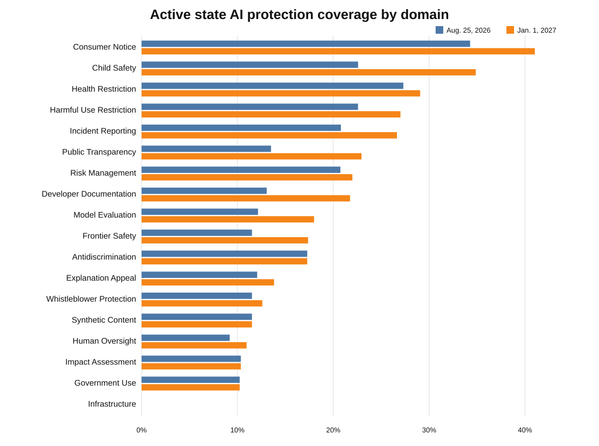
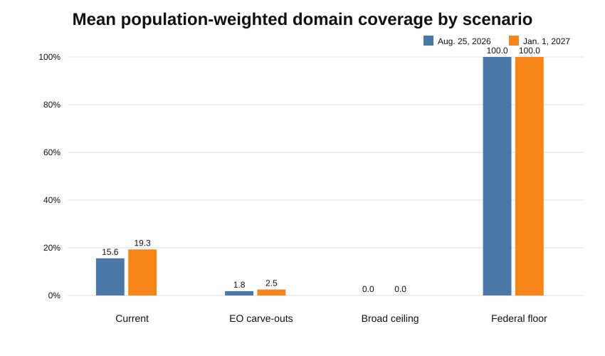
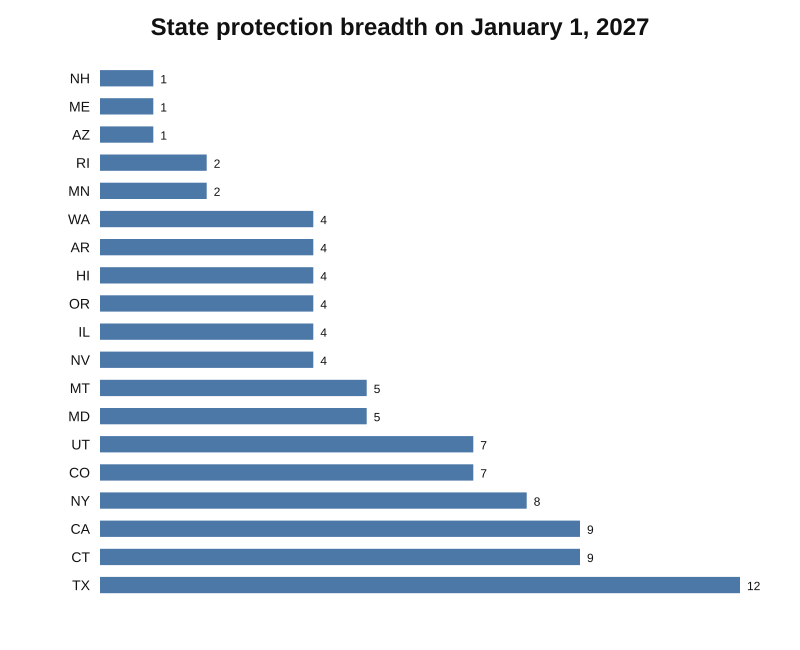

# Federal Floor or Federal Ceiling?

## The Coverage and Fragmentation Effects of Preempting State AI Laws

An empirical U.S. AI federalism project measuring which state-level AI protections would be preserved, displaced, or standardized under alternative federal preemption frameworks.

> **Research status:** provisional empirical results are now available. The statutory universe is frozen as of **August 25, 2026**, the full source-clean corpus has been coded, and retained rows have undergone AI-assisted primary-text adjudication. The estimates below are working-paper results, **not publication-grade legal coding until independent human review is completed**.

**Original contribution:** an obligation-level estimate of how federal AI ceilings, carve-outs, and floors change population-weighted protection coverage and cross-state regulatory heterogeneity. The qualified novelty claim and closest related studies are documented in [`docs/literature_review.md`](docs/literature_review.md).

## Main question

Would federal preemption reduce regulatory fragmentation without removing meaningful protections created by state AI laws?

## Provisional findings

Using Census Vintage 2025 population weights across the 50 states plus D.C.:

- On **August 25, 2026**, 15 states have at least one active substantive coded AI protection, representing **41.7%** of the U.S. state + D.C. population.
- By **January 1, 2027**, 19 states have at least one active substantive coded protection, representing **47.4%** of the population.
- Mean population-weighted coverage across the 18 substantive codebook domains rises from **15.6%** to **19.3%**.
- Consumer notice is the broadest coded domain: **34.3%** of the population at the primary snapshot and **41.0%** at the 2027 snapshot.
- Child-safety coverage grows from **22.6%** to **34.9%**, the largest near-term increase among the coded substantive domains.
- Under the deliberately strong **broad federal ceiling** benchmark, selected state protection coverage is set to zero by construction.
- Under the **EO 14365 carve-out** benchmark, only child-safety, infrastructure, and government-use protections survive. That retains about **11.7%** of aggregate observed domain coverage on August 25, 2026 and **13.0%** on January 1, 2027.
- A stylized strength-1 **federal floor** closes geographic coverage gaps by construction while preserving stronger state scores.

These are descriptive counterfactuals, not causal estimates of innovation, compliance cost, safety, or welfare.







## Data and review status

The frozen discovery registry contains **52 candidate state measures**. The source-clean main and supplemental runs produced **238 first-pass candidate rows**. After primary-text adjudication and manual recovery of provisions missed inside omnibus or codified laws, the final working analysis contains **247 positive obligation rows across 39 laws**.

The review pass corrected recurring issues including:

- general chatbot disclosure mislabeled as child safety;
- health-specific prohibitions mislabeled as generic harmful-use restrictions;
- record-retention duties mislabeled as risk-management programs;
- regulator audit authority incorrectly treated as an independent regulated-entity duty;
- individual correction or reconsideration rights underscored as procedural rather than rights; and
- provisions missed in Minnesota, Connecticut, Maine, New York, and California omnibus or codified text.

Every retained quotation in the working adjudication dataset is traceable to official primary legal text after normalization. The released repository tables are provisional analytical outputs; the row-level adjudication dataset is not treated as publication-grade legal data until independent human review is complete.

## Corpus cost and reproducibility

Known Claude API spend:

| Stage | Actual spend |
|---|---:|
| Pilot 1 | $0.069334 |
| Pilot 2 | $0.140119 |
| Pilot 3 | $0.141433 |
| Full main corpus | $0.423328 |
| Snapshot supplement | $0.084259 |
| **Total** | **$0.858473** |

Model snapshot: `claude-haiku-4-5-20251001`.

Paid runs occurred only after source and test gates passed.

## Scenario definitions

| Regime | Policy rule | Interpretation |
|---|---|---|
| Current state system | Active reviewed state obligations remain | Observed protection coverage and heterogeneity |
| Broad federal ceiling | Selected state obligations set to zero | Upper-bound displacement benchmark |
| EO 14365 carve-outs | Broad ceiling except child safety, infrastructure, government use | Targeted preservation benchmark |
| Federal floor | `max(state strength, federal minimum)` | Geographic gaps closed while stricter state rules remain |

See [`docs/final_analysis_protocol.md`](docs/final_analysis_protocol.md) and [`docs/policy_scenarios.md`](docs/policy_scenarios.md).

## Results files

- [`results/README.md`](results/README.md)
- [`results/domain_coverage_2026-08-25.csv`](results/domain_coverage_2026-08-25.csv)
- [`results/domain_coverage_2027-01-01.csv`](results/domain_coverage_2027-01-01.csv)
- [`results/scenario_summary.csv`](results/scenario_summary.csv)
- [`results/scenarios_by_domain_2026-08-25.csv`](results/scenarios_by_domain_2026-08-25.csv)
- [`results/scenarios_by_domain_2027-01-01.csv`](results/scenarios_by_domain_2027-01-01.csv)
- [`results/state_summary.csv`](results/state_summary.csv)

## Method

The coding unit is:

`state × law × enforceable obligation × regulated actor × sector × effective period`

A dated snapshot includes an obligation only when:

`effective_date <= analysis_date < inactive_from_date`

The primary protection estimates use only substantive domains. Enforcement and scope rules remain in the review dataset but are not counted as substantive protection coverage.

Population coverage for domain `d` is:

`sum(population_s × 1[strength_sd >= 1]) / sum(population_s)`

Strength is an ordinal description of legal form:

- 0 absent
- 1 disclosure/reporting/documentation/procedure
- 2 assessment/risk management/mitigation/evaluation/human review
- 3 prohibition or individual right

It is **not** a welfare score or an estimate of enforcement effectiveness.

## Research safeguards

- Primary legal text controls final coding; trackers are discovery aids.
- Amendment and supersession chains are preserved.
- Mixed-effective-date statutes require obligation-level dates.
- Positive rows require a statutory quotation and section reference.
- Missing provisions found in omnibus laws are added as explicit manual-recovery rows rather than treated as state-level zeros.
- The broad-ceiling simulation is a bounding counterfactual, not a legal prediction.
- Independent human review remains required before publication-grade confirmatory claims.

## Repository structure

```text
config/                 source universe, domains, scenario inputs
data/                   runtime legal text and validation outputs
docs/                   research design, validation, literature, final protocol
figures/                vector figures from provisional results
paper/                  working paper
results/                provisional empirical tables
src/us_ai_federalism/   ingestion, coding, temporal logic, metrics
tests/                  unit and integration tests
tools/                  reproducible helpers
```

## Author

Sriramkrishnan (Raam) Nandhakumar

## License

Code is released under the MIT License. Statutory text and third-party source material remain subject to their original terms.
